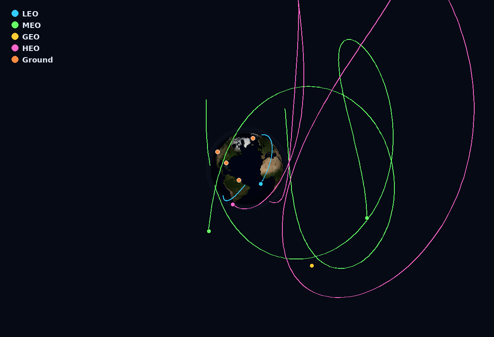

# Globe Viz — 3D Satellite Globe for Splunk

An interactive 3D globe custom visualization for Splunk that plots **satellites and
orbital objects** (propagated from TLE data) and **ground sites** (lat/lon), and
classifies every satellite by **orbit regime — LEO, MEO, GEO, HEO**.

It is **fully self-contained**: no CesiumJS, no `satellite.js`, no external files, and
**no network calls**. The orbital mechanics and the rendering are built in, and a
photoreal NASA Blue Marble Earth texture is embedded in the app — so it runs on an
**air-gapped Splunk** with nothing to download.




---

## Contents

- [Features](#features)
- [Compatibility](#compatibility)
- [Installation](#installation)
- [Quick start](#quick-start)
- [Satellite mapping — feeding it data](#satellite-mapping--feeding-it-data)
- [Orbit classification](#orbit-classification)
- [The bundled dashboard](#the-bundled-dashboard)
- [Using the visualization in your own dashboards](#using-the-visualization-in-your-own-dashboards)
- [Options reference](#options-reference)
- [Controls](#controls)
- [Real satellite imagery](#real-satellite-imagery)
- [How it works](#how-it-works)
- [Accuracy & limitations](#accuracy--limitations)
- [Repository layout](#repository-layout)
- [Building the .spl](#building-the-spl)
- [Troubleshooting](#troubleshooting)
- [Credits & license](#credits--license)

---

## Features

- **Interactive 3D globe** rendered with the HTML5 Canvas 2D API (orthographic projection
  with spherical limb shading and atmosphere glow). Drag to rotate, scroll to zoom.
- **Photoreal Earth** — embedded NASA Blue Marble texture. Drop in a higher-res image or
  switch to a simple vector globe.
- **Satellite tracking from TLEs** — a built-in Kepler (two-body) propagator computes and
  animates each orbit; no external orbital library.
- **Orbit-regime classification** — LEO / MEO / GEO / HEO (plus Ground), auto-detected
  from the orbital elements, each colored, with an interactive legend to toggle classes.
- **Ground / lat-lon mapping** — plot ground stations, cities, or precomputed positions.
- **Click for details** — apogee, perigee, period, inclination, eccentricity (satellites)
  or lat/lon/alt (ground).
- **On-globe speed controls** — pause / 1x / 10x / 60x / 300x.
- **Zoom range** framed so GEO and HEO orbits are visible; defaults to framing all orbits.
- **100% offline / air-gapped** — no CDNs, no downloads, no runtime network requests.
- Ships with **sample data** (all orbit classes + ground sites) and a ready-made dashboard.

## Compatibility

- Splunk Enterprise and Splunk Cloud.
- **Classic Simple XML** dashboards and the Search & Reporting visualization picker.
  (Not Splunk Dashboard Studio — that is a separate framework.)
- Any modern browser with HTML5 Canvas.

## Installation

**From the packaged app (recommended):**

- Splunk Web: **Apps → Manage Apps → Install app from file** → upload `globe_viz_<version>.spl` → restart.
- Or CLI / on-prem:
  ```bash
  tar -xzf globe_viz_<version>.spl -C $SPLUNK_HOME/etc/apps/
  $SPLUNK_HOME/bin/splunk restart
  ```

**Air-gapped:** the `.spl` is self-contained — just transfer and install it. Nothing to
download at install time or runtime.

After installing (or upgrading), clear Splunk's static cache so the browser picks up the
new assets: visit `https://<splunk>/en-US/_bump` → **Bump Version**, then open the
dashboard in a fresh browser tab (or Incognito window).

## Quick start

1. Open the **Globe Viz** app → the **Satellite Globe** dashboard (loads with bundled
   sample data spanning every orbit class).
2. Or run any search that returns the right columns, open the **Visualizations** tab, and
   pick **3D Globe**.

Bundled sample search:
```spl
| inputlookup satellites.csv | table name orbit_class tle1 tle2
| append [| inputlookup ground_stations.csv | table name orbit_class lat lon]
```

## Satellite mapping — feeding it data

The visualization reads ordinary table columns. Provide **either** TLE columns **or**
coordinate columns (you can mix both in one result set — each row is handled
independently). Column names are auto-detected; override them in
**Format → Field mapping** if yours differ.

### Mode A — Orbital objects from TLE

Give it two-line element sets and it propagates + animates the orbit and classifies the
regime automatically.

| Column        | Required | Notes |
|---------------|----------|-------|
| `name`        | no       | Label shown on the globe |
| `tle1`        | yes      | TLE line 1 (aliases: `line1`, `tle_line1`) |
| `tle2`        | yes      | TLE line 2 (aliases: `line2`, `tle_line2`) |
| `orbit_class` | no       | Override auto-classification (`LEO`/`MEO`/`GEO`/`HEO`/`Ground`) |
| `color`       | no       | Per-row CSS color (e.g. `#ff0000`, `red`) |

Example (from a lookup):
```spl
| inputlookup satellites.csv | table name orbit_class tle1 tle2
```

Single-object smoke test:
```spl
| makeresults
| eval name="ISS",
       tle1="1 25544U 98067A   26197.50000000 .00000000  00000-0  00000-0 0  40007",
       tle2="2 25544  51.6400  95.0000 0006000 120.0000 240.0000 15.50000000 40002"
| table name tle1 tle2
```

**Where to get TLEs:** public sources include [CelesTrak](https://celestrak.org/NORAD/elements/)
(grouped GP element sets) and [Space-Track](https://www.space-track.org/) (account
required). On an air-gapped site, import a TLE file through your approved data-transfer
process into a lookup (`name,tle1,tle2`) or an index with `tle1`/`tle2` fields. The
visualization itself never reaches the network.

### Mode B — Ground sites / precomputed positions (lat + lon)

| Column        | Required | Notes |
|---------------|----------|-------|
| `name`        | no       | Label |
| `lat`         | yes      | Latitude, degrees (aliases: `latitude`) |
| `lon`         | yes      | Longitude, degrees (aliases: `lng`, `long`, `longitude`) |
| `alt`         | no       | Altitude (km by default; set units in Format menu). `0`/absent = surface |
| `orbit_class` | no       | Force a class/color (e.g. `Ground`) |
| `color`       | no       | Per-row CSS color |

```spl
index=tracking sourcetype=positions | table object_name lat lon alt
```
Surface objects sit on the globe; anything with altitude floats above it and is
classified by altitude band.

## Orbit classification

Computed from the TLE-derived orbital elements (or the `alt` value in lat/lon mode):

| Class | Rule | Examples |
|-------|------|----------|
| **LEO** | mean altitude < 2,000 km | ISS, Starlink, Earth-observation, polar/SSO |
| **MEO** | 2,000 – 35,586 km | GPS, Galileo, GLONASS |
| **GEO** | ~35,786 km, period ≈ 1,436 min, inclination < 15°, ecc < 0.02 | GOES, Intelsat |
| **HEO** | eccentricity ≥ 0.25 | Molniya, Tundra, GTO |
| **Ground** | surface objects (lat/lon, no altitude) | stations, cities |

Add an `orbit_class` column to override the automatic result for any row.

## The bundled dashboard

The **Satellite Globe** dashboard includes:

- An **Orbit class filter** (All / LEO / MEO / GEO / HEO / Ground).
- The interactive globe panel.
- An **Objects by orbit class** bar chart.
- A **Catalog** table of all objects.

Sample data: ISS + Sentinel-2 (LEO), GPS + Galileo (MEO), GOES-16 + Intelsat (GEO),
Molniya + Tundra (HEO), plus ground stations (Svalbard, Cape Canaveral, Vandenberg,
Guiana, Goldstone, Canberra).

## Using the visualization in your own dashboards

The viz is exported globally (`metadata/default.meta` → `export = system`), so once
`globe_viz` is installed it is available in **every** app. In any Simple XML dashboard:

```xml
<viz type="globe_viz.globe">
  <search>
    <query>| inputlookup satellites.csv | table name orbit_class tle1 tle2</query>
    <earliest>-24h@h</earliest><latest>now</latest>
  </search>
  <option name="height">640</option>
  <option name="display.visualizations.custom.globe_viz.globe.colorByOrbitClass">true</option>
  <option name="display.visualizations.custom.globe_viz.globe.showOrbits">true</option>
  <option name="display.visualizations.custom.globe_viz.globe.clockMultiplier">1</option>
</viz>
```

`type` is always `globe_viz.globe`; options are always
`display.visualizations.custom.globe_viz.globe.<option>`.

## Options reference

All set via the Format menu, or as `<option name="display.visualizations.custom.globe_viz.globe.<name>">`.

| Option | Default | Description |
|--------|---------|-------------|
| `colorByOrbitClass` | `true` | Color points/orbits by orbit class |
| `showLegend` | `true` | Show the interactive orbit-class legend |
| `leoColor` / `meoColor` / `geoColor` / `heoColor` / `groundColor` | class defaults | Per-class colors |
| `objectColor` | `#33ccff` | Point color when not coloring by class |
| `pointSize` | `5` | Satellite point size (px) |
| `showLabels` | `true` | Draw object names |
| `useTexture` | `true` | Textured Earth (off = simple vector globe) |
| `showGraticule` | `false` | Lat/lon grid lines |
| `showOrbits` | `true` | Draw orbit paths for TLE objects |
| `clockMultiplier` | `1` | Initial animation speed (× realtime) |
| `orbitWindowHours` | `3` | Orbit-track window length |
| `altUnits` | `km` | Units for the `alt` column (`km` or `m`) |
| `textureUrl` | *(blank)* | Explicit Earth image URL (blank = auto/built-in) |
| `nameField` / `classField` / `latField` / `lonField` / `altField` / `tle1Field` / `tle2Field` / `colorField` | *(auto)* | Field-name overrides |

## Controls

- **Drag** — rotate the globe.
- **Scroll** — zoom (out far enough to see GEO/HEO, in to inspect the map).
- **Legend** (top-right) — click a class to show/hide it.
- **Speed bar** (bottom-left) — pause / 1x / 10x / 60x / 300x. These always work; the
  dashboard `clockMultiplier` option just sets the starting speed.
- **Click** a satellite or ground point for a details tooltip.

## Real satellite imagery

The app ships with a photoreal NASA Blue Marble texture **embedded** (2700×1350), so it
works out of the box, offline. To use your own / higher-resolution imagery:

- **Drop-in file:** save an equirectangular Earth image as `earth.jpg` (or `earth.png`)
  in `appserver/static/visualizations/globe/`. The app auto-detects and uses it over the
  embedded one. A single same-origin file — no CSP or worker issues.
- **URL:** point **Format → Earth image → Earth texture URL** at any equirectangular
  image your browser can reach.

Source imagery: NASA Visible Earth *Blue Marble*
(https://visibleearth.nasa.gov/collection/1484/blue-marble), equirectangular, 2:1 aspect.

## How it works

- **No dependencies.** Everything is in one `visualization.js`: the globe renderer, the
  orbital propagator, the coastline fallback, and the base64 Earth texture.
- **Propagation.** TLEs are parsed and propagated with a two-body Kepler model
  (`M → E → true anomaly → ECI`), then converted to earth-fixed lat/lon/alt using GMST.
- **Rendering.** An orthographic projection maps the textured sphere (computed once per
  orientation on an offscreen canvas) to the panel; satellites and orbit tracks are drawn
  on top with correct front/back-hemisphere occlusion.
- **Offline by design.** Splunk's Content-Security-Policy blocks external scripts; this
  app needs none, which is why it works in locked-down / air-gapped deployments.

## Accuracy & limitations

- Propagation is **two-body Keplerian** (no J2, drag, or SGP4 perturbations). It
  reproduces orbit shape, size, inclination, and period faithfully for visualization, but
  is **not** a precision conjunction/tracking tool. Refresh TLEs regularly and expect
  small drift versus full SGP4 over long spans.
- Row cap is 50,000 (Splunk custom-viz API). Thousands of animated orbits will tax the
  GPU; pre-filter or use precomputed points for very large catalogs.
- The globe is a texture-mapped sphere (orthographic), not a full WebGL engine.

## Repository layout

```
globe_viz/                         # the Splunk app
├── default/
│   ├── app.conf
│   ├── visualizations.conf
│   ├── transforms.conf            # lookup definitions
│   └── data/ui/
│       ├── nav/default.xml
│       └── views/satellite_globe.xml   # bundled dashboard
├── lookups/
│   ├── satellites.csv             # sample TLEs (all classes)
│   └── ground_stations.csv        # sample ground sites
├── metadata/default.meta          # exports the viz globally
└── appserver/static/
    ├── appIcon*.png, preview.png
    └── visualizations/globe/
        ├── visualization.js       # the whole plugin (renderer + orbit math + texture)
        ├── visualization.css
        └── formatter.html         # Format-menu options
globe_demo.html                    # standalone browser demo (no Splunk needed)
docs/globe.png                     # screenshot
```

## Building the .spl

A `.spl` is just a gzipped tar of the app directory:
```bash
tar -czf globe_viz.spl globe_viz
```
Install the result via **Apps → Install app from file**.

## Troubleshooting

- **Old behavior after upgrading / blank panel** — Splunk and the browser cache the viz
  JS. Visit `/en-US/_bump` → Bump Version, then reload in an Incognito window.
- **"No plottable rows found"** — provide `tle1`/`tle2` or `lat`/`lon`, or map your field
  names in Format → Field mapping.
- **Can't see GEO/HEO** — scroll to zoom out; the default view frames all orbits.
- **Speed dropdown seems stuck** — use the on-globe speed buttons; the dashboard option
  sets only the initial value.

## Credits & license

- Earth imagery: **NASA Visible Earth — Blue Marble** (public domain).
- Application code: MIT License — free to use, modify, and distribute.

> This project is not affiliated with or endorsed by Splunk Inc. or NASA.
