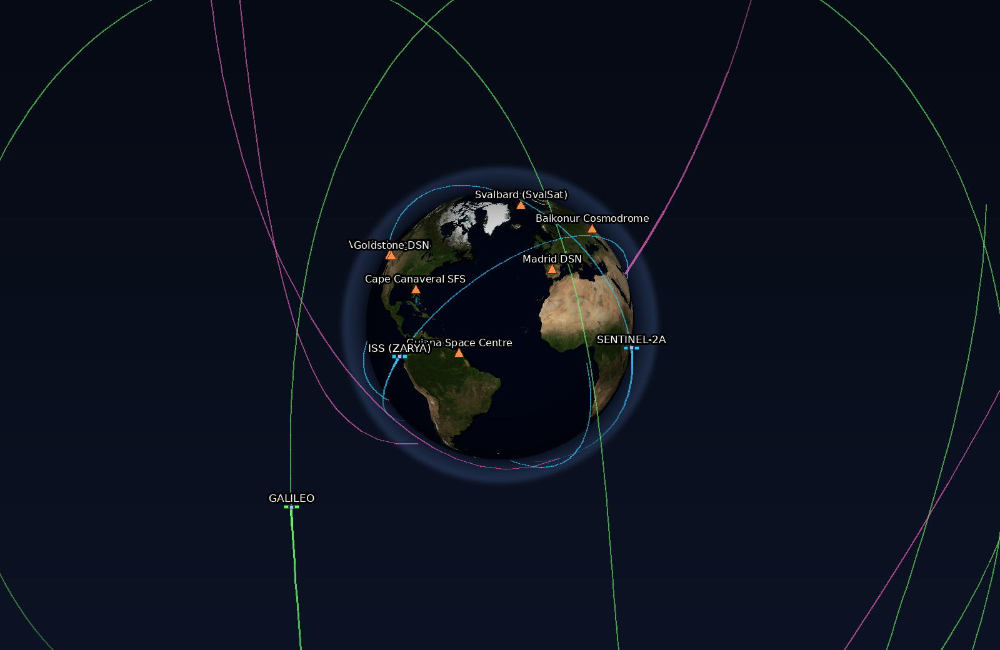
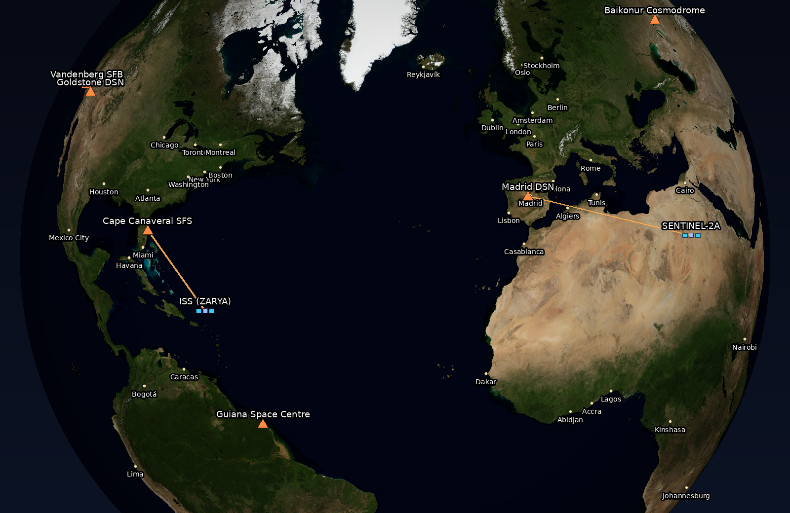

# Globe Viz — 3D Satellite Globe for Splunk

An interactive 3D globe custom visualization for Splunk that plots **satellites and
orbital objects** (propagated from TLE data) and **ground sites** (lat/lon), and
classifies every satellite by **orbit regime — LEO, MEO, GEO, HEO**.

It is **fully self-contained**: no CesiumJS, no bundled libraries, and **no network
calls**. The orbital mechanics and the rendering are built in, and real NASA Blue Marble
Earth imagery is embedded in the app — so it runs on an **air-gapped Splunk** with nothing
to download. (Full SGP4 and higher-res imagery are optional same-origin drop-ins; see
[Accuracy](#accuracy--propagation) and [Real satellite imagery](#real-satellite-imagery).)




---

## Contents

- [Features](#features)
- [Compatibility](#compatibility)
- [Installation](#installation)
- [Quick start](#quick-start)
- [Satellite mapping — feeding it data](#satellite-mapping--feeding-it-data)
- [Orbit classification](#orbit-classification)
- [The bundled dashboard](#the-bundled-dashboard)
- [Using the visualization in your own dashboards](#using-the-visualization-in-your-own-dashboards)
- [Options reference](#options-reference)
- [Controls](#controls)
- [Real satellite imagery](#real-satellite-imagery)
- [Dashboard interactivity (drilldown)](#dashboard-interactivity-drilldown)
- [How it works](#how-it-works)
- [Accuracy & propagation](#accuracy--propagation)
- [Repository layout](#repository-layout)
- [Building the .spl](#building-the-spl)
- [Troubleshooting](#troubleshooting)
- [Credits & license](#credits--license)

---

## Features

- **3D globe or 2D map** — switch between an interactive 3D globe (orthographic, limb
  shading, atmosphere glow) and a flat equirectangular world map, from a single button.
  Both drag to pan/rotate and scroll to zoom.
- **Settings menu (⚙)** — all the layer toggles, tools, and the propagator selector live in
  a tidy settings panel; the globe face stays clean with just the view switch, search,
  time bar, and legend. The active propagator (SGP4 / Kepler+J2) is shown as a badge.
- **Photoreal Earth** — embedded NASA Blue Marble texture. Drop in a higher-res image or
  switch to a simple vector globe.
- **Satellite tracking from TLEs** — a built-in Kepler + **J2** propagator computes and
  animates each orbit (optional drop-in SGP4); no external orbital library required.
- **Motion trails** — a fading tail behind each object showing recent travel, computed from
  the propagator so it looks identical at any animation speed.
- **Orbit-regime classification** — LEO / MEO / GEO / HEO (plus Ground), auto-detected
  from the orbital elements, each colored, with an interactive legend to toggle classes.
- **Ground / lat-lon mapping** — plot ground stations, cities, or precomputed positions.
- **Ground↔satellite connections** — optional line-of-sight links from each ground
  station to the satellites currently above a configurable elevation mask, colored by
  elevation (amber = low on the horizon, green = overhead). Updates live as satellites
  pass over — watch contact windows open and close.
- **Cities layer** — ~130 major world cities that appear progressively as you zoom in
  (embedded; no map tiles, works offline).
- **Toggleable analysis layers** (on-globe chips + Format-menu options): satellite
  **coverage footprints**, **ground tracks**, a **day/night terminator** (with eclipse
  dimming of satellites in Earth's shadow), and **ground-station FOV rings**.
- **Search + select + passes** — find an object by name; selecting highlights its orbit,
  dims the rest, and opens a panel with orbital parameters and **next-pass predictions**
  (AOS/LOS + max elevation) over each ground station.
- **Interactive linking (🔗 Link tool)** — click any two objects (satellite↔satellite or
  satellite↔ground) to draw a connection, alongside the data-driven links from your search.
- **Color by any field** — color objects by an arbitrary column (country/operator/type).
- **Time controls** — a clock (UTC, browser-local, or any IANA time zone), a time scrubber,
  ±10m/±1h step buttons, a "set exact time" field, and **Now**. Jump to any instant and every
  satellite snaps to exactly where it is then (and pass predictions recompute from that
  time); play/pause/speed still work.
- **Satellite icons** — objects render as a satellite glyph (body + solar panels) colored
  by class; ground stations as triangles.
- **Click-to-drilldown** — clicking an object sets Splunk dashboard tokens so other panels
  react (see "Dashboard interactivity").
- **Export** — download the current view as **PNG**, or the visible objects as **CSV**.
- **Accurate propagation** — built-in Kepler **+ J2 secular perturbations** (nodal/apsidal
  precession), or drop in `satellite.min.js` for full **SGP4** (see "Accuracy").
- **Click for details** — apogee, perigee, period, inclination, eccentricity (satellites)
  or lat/lon/alt (ground).
- **On-globe speed controls** — pause / 1x / 10x / 60x / 300x.
- **Zoom range** framed so GEO and HEO orbits are visible; defaults to framing all orbits.
- **100% offline / air-gapped** — no CDNs, no downloads, no runtime network requests.
- Ships with **sample data** (all orbit classes + ground sites) and a ready-made dashboard.

Zoomed in — cities, ground stations, and live ground→satellite connection lines:



## Compatibility

- Splunk Enterprise and Splunk Cloud.
- **Classic Simple XML** dashboards and the Search & Reporting visualization picker.
  (Not Splunk Dashboard Studio — that is a separate framework.)
- Any modern browser with HTML5 Canvas.

## Installation

**From the packaged app (recommended):**

- Splunk Web: **Apps → Manage Apps → Install app from file** → upload `globe_viz_<version>.spl` → restart.
- Or CLI / on-prem:
  ```bash
  tar -xzf globe_viz_<version>.spl -C $SPLUNK_HOME/etc/apps/
  $SPLUNK_HOME/bin/splunk restart
  ```

**Air-gapped:** the `.spl` is self-contained — just transfer and install it. Nothing to
download at install time or runtime.

After installing (or upgrading), clear Splunk's static cache so the browser picks up the
new assets: visit `https://<splunk>/en-US/_bump` → **Bump Version**, then open the
dashboard in a fresh browser tab (or Incognito window).

## Quick start

1. Open the **Globe Viz** app → the **Satellite Globe** dashboard (loads with bundled
   sample data spanning every orbit class).
2. Or run any search that returns the right columns, open the **Visualizations** tab, and
   pick **3D Globe**.

Bundled sample search:
```spl
| inputlookup satellites.csv | table name orbit_class tle1 tle2
| append [| inputlookup ground_stations.csv | table name orbit_class lat lon]
```

## Satellite mapping — feeding it data

The visualization reads ordinary table columns. Provide **either** TLE columns **or**
coordinate columns (you can mix both in one result set — each row is handled
independently). Column names are auto-detected; override them in
**Format → Field mapping** if yours differ.

### Mode A — Orbital objects from TLE

Give it two-line element sets and it propagates + animates the orbit and classifies the
regime automatically.

| Column        | Required | Notes |
|---------------|----------|-------|
| `name`        | no       | Label shown on the globe |
| `tle1`        | yes      | TLE line 1 (aliases: `line1`, `tle_line1`) |
| `tle2`        | yes      | TLE line 2 (aliases: `line2`, `tle_line2`) |
| `orbit_class` | no       | Override auto-classification (`LEO`/`MEO`/`GEO`/`HEO`/`Ground`) |
| `color`       | no       | Per-row CSS color (e.g. `#ff0000`, `red`) |

Example (from a lookup):
```spl
| inputlookup satellites.csv | table name orbit_class tle1 tle2
```

Single-object smoke test:
```spl
| makeresults
| eval name="ISS",
       tle1="1 25544U 98067A   26197.50000000 .00000000  00000-0  00000-0 0  40007",
       tle2="2 25544  51.6400  95.0000 0006000 120.0000 240.0000 15.50000000 40002"
| table name tle1 tle2
```

**Where to get TLEs:** public sources include [CelesTrak](https://celestrak.org/NORAD/elements/)
(grouped GP element sets) and [Space-Track](https://www.space-track.org/) (account
required). On an air-gapped site, import a TLE file through your approved data-transfer
process into a lookup (`name,tle1,tle2`) or an index with `tle1`/`tle2` fields. The
visualization itself never reaches the network.

### Mode B — Ground sites / precomputed positions (lat + lon)

| Column        | Required | Notes |
|---------------|----------|-------|
| `name`        | no       | Label |
| `lat`         | yes      | Latitude, degrees (aliases: `latitude`) |
| `lon`         | yes      | Longitude, degrees (aliases: `lng`, `long`, `longitude`) |
| `alt`         | no       | Altitude (km by default; set units in Format menu). `0`/absent = surface |
| `orbit_class` | no       | Force a class/color (e.g. `Ground`) |
| `color`       | no       | Per-row CSS color |

```spl
index=tracking sourcetype=positions | table object_name lat lon alt
```
Surface objects sit on the globe; anything with altitude floats above it and is
classified by altitude band.

### Showing interactions / contacts from a search (data-driven links)

The connection view has two modes (**Format → Ground-satellite connections → Connection
source**):

- **Line-of-sight (`geometry`)** — the viz computes which satellites are above each
  station's horizon and links them. No extra data needed.
- **From search (`data`)** — the viz draws a link **only where your search says two
  objects are interacting**. Use this to show real contacts from telemetry, contact logs,
  or a schedule. (`both` overlays the two.)

To feed data links, add **link rows** to the result set — rows carrying a `from` and a
`to` that name two plotted objects (matched to their `name`, case-insensitive), optionally
with a `status`:

| Column   | Meaning |
|----------|---------|
| `from`   | one endpoint's name (e.g. a ground station). Aliases: `source`, `link_from` |
| `to`     | other endpoint's name (e.g. a satellite). Aliases: `target`, `link_to` |
| `status` | optional; colors the line: `active`/`contact`/`up` = green, `scheduled`/`planned` = amber, `down`/`lost`/`error` = red, else blue. Aliases: `state`, `link_status` |
| `color`  | optional; explicit CSS color, overrides status |

Example — plot the catalog, then draw a link for every current contact from a contact
index:

```spl
| inputlookup satellites.csv | table name orbit_class tle1 tle2
| append [ | inputlookup ground_stations.csv | table name orbit_class lat lon ]
| append
    [ search index=ground_contacts earliest=-5m
    | dedup station satellite
    | eval from=station, to=satellite, status=status
    | table from to status ]
```

Set **Connection source = From search**. Only station↔satellite pairs present in your
contact events get a line, updated as the search refreshes. The `from`/`to` values must
match the object names exactly (case-insensitive) — e.g. `to="ISS (ZARYA)"`.

Alternative (one row per object): add a `connects_to` column listing the names it links to,
comma-separated — e.g. a satellite row with `connects_to="Svalbard, Goldstone"`.

**Simplest of all — define links in the command** with the `links` option (no data rows
needed): `links="ISS (ZARYA)>Svalbard (SvalSat):active, GALILEO>Madrid DSN"`. Each entry is
`from>to` with an optional `:status`. Defined links (from rows, `connects_to`, or the
`links` option) show when the **Links** layer is on and **Connection source** is `From
search` or `Both`.

## Orbit classification

Computed from the TLE-derived orbital elements (or the `alt` value in lat/lon mode):

| Class | Rule | Examples |
|-------|------|----------|
| **LEO** | mean altitude < 2,000 km | ISS, Starlink, Earth-observation, polar/SSO |
| **MEO** | 2,000 – 35,586 km | GPS, Galileo, GLONASS |
| **GEO** | ~35,786 km, period ≈ 1,436 min, inclination < 15°, ecc < 0.02 | GOES, Intelsat |
| **HEO** | eccentricity ≥ 0.25 | Molniya, Tundra, GTO |
| **Ground** | surface objects (lat/lon, no altitude) | stations, cities |

Add an `orbit_class` column to override the automatic result for any row.

## The bundled dashboard

The **Satellite Globe** dashboard includes:

- An **Orbit class filter** (All / LEO / MEO / GEO / HEO / Ground).
- The interactive globe panel.
- An **Objects by orbit class** bar chart.
- A **Catalog** table of all objects.

Sample data: ISS + Sentinel-2 (LEO), GPS + Galileo (MEO), GOES-16 + Intelsat (GEO),
Molniya + Tundra (HEO), plus ground stations (Svalbard, Cape Canaveral, Vandenberg,
Guiana, Goldstone, Canberra).

## Using the visualization in your own dashboards

The viz is exported globally (`metadata/default.meta` → `export = system`), so once
`globe_viz` is installed it is available in **every** app. In any Simple XML dashboard:

```xml
<viz type="globe_viz.globe">
  <search>
    <query>| inputlookup satellites.csv | table name orbit_class tle1 tle2</query>
    <earliest>-24h@h</earliest><latest>now</latest>
  </search>
  <option name="height">640</option>
  <option name="display.visualizations.custom.globe_viz.globe.colorByOrbitClass">true</option>
  <option name="display.visualizations.custom.globe_viz.globe.showOrbits">true</option>
  <option name="display.visualizations.custom.globe_viz.globe.clockMultiplier">1</option>
</viz>
```

`type` is always `globe_viz.globe`; options are always
`display.visualizations.custom.globe_viz.globe.<option>`.

## Options reference

All set via the Format menu, or as `<option name="display.visualizations.custom.globe_viz.globe.<name>">`.

| Option | Default | Description |
|--------|---------|-------------|
| `colorByOrbitClass` | `true` | Color points/orbits by orbit class |
| `showLegend` | `true` | Show the interactive orbit-class legend |
| `leoColor` / `meoColor` / `geoColor` / `heoColor` / `groundColor` | class defaults | Per-class colors |
| `objectColor` | `#33ccff` | Point color when not coloring by class |
| `pointSize` | `5` | Satellite point size (px) |
| `showLabels` | `true` | Draw object names |
| `useTexture` | `true` | Textured Earth (off = simple vector globe) |
| `showGraticule` | `false` | Lat/lon grid lines |
| `showCities` | `true` | Show major cities (appear as you zoom in) |
| `showConnections` | `false` | Draw ground→satellite line-of-sight links |
| `minElevationDeg` | `10` | Elevation mask (deg) for a satellite to count as "in contact" (geometry mode) |
| `connectionMode` | `geometry` | `geometry` (line-of-sight), `data` (from/to rows in the search), or `both` |
| `showFootprints` | `false` | Satellite coverage (horizon) circles |
| `showGroundTrack` | `false` | Sub-satellite ground tracks |
| `showTrails` | `true` | Fading motion trail behind each object (speed-independent; computed from the propagator) |
| `showTerminator` | `false` | Day/night shading + eclipse dimming |
| `showStationFov` | `false` | Ground-station FOV coverage rings |
| `fovRefAltKm` | `800` | Reference altitude for the FOV rings |
| `passHours` | `24` | Window for next-pass predictions in the detail panel |
| `colorBy` | *(blank)* | Color objects by this field instead of orbit class |
| `timeWindowHours` | `24` | Time scrubber spans ± this many hours around its anchor |
| `atTime` | *(blank)* | Open paused at a fixed UTC instant (e.g. `2026-07-16T18:00Z`) |
| `timeZone` | `UTC` | Time zone for the clock & picker: `UTC`, `local`, or any IANA name (e.g. `America/New_York`). Also switchable in Settings. |
| `propagator` | `auto` | `auto` (SGP4 if `satellite.min.js` present, else built-in), `builtin`, or `sgp4` |
| `view` | `3d` | Default view: `3d` globe or `2d` equirectangular map |
| `seasonalTexture` | `true` | Swap the Earth image by calendar season (winter/spring/summer/autumn) |
| `links` | *(blank)* | Static links defined in the command: `A>B, C>D:active` (optional `:status`) |
| `showOrbits` | `true` | Draw orbit paths for TLE objects |
| `clockMultiplier` | `1` | Initial animation speed (× realtime) |
| `orbitWindowHours` | `3` | Orbit-track window length |
| `altUnits` | `km` | Units for the `alt` column (`km` or `m`) |
| `textureUrl` | *(blank)* | Explicit Earth image URL (blank = auto/built-in) |
| `nameField` / `classField` / `latField` / `lonField` / `altField` / `tle1Field` / `tle2Field` / `colorField` | *(auto)* | Field-name overrides |

## Controls

- **Drag** — rotate the globe (pan, in 2D map mode).
- **Scroll** — zoom (out far enough to see GEO/HEO, in to inspect the map).
- **⚙ Settings** (top-left) — layer toggles (trails, footprints, ground tracks, day/night,
  FOV, links, cities), the 🔗 Link tool, PNG/CSV export, the propagator selector, and the
  **time-zone** picker. The view switch (**2D/3D**) and the active-propagator badge sit in
  the toolbar next to it.
- **Legend** (top-right) — click a class to show/hide it.
- **Bottom bar** — pause / 1x / 10x / 60x / 300x speed, then the clock, ±10m/±1h steps,
  **Now**, the time scrubber, and the exact-time picker. Speed always works; the dashboard
  `clockMultiplier` option just sets the starting speed.
- **Search** (top-right) — find and select an object by name.
- **Click** a satellite or ground point for a details tooltip (and to drive drilldown).

## Real satellite imagery

The app ships with real NASA Blue Marble imagery **embedded** (four seasonal monthly
composites at 2048×1024; see below), so it works out of the box, offline. To use your own /
higher-resolution imagery:

- **Drop-in file:** save an equirectangular Earth image as `earth.jpg` (or `earth.png`)
  in `appserver/static/visualizations/globe/`. The app auto-detects and uses it over the
  embedded one. A single same-origin file — no CSP or worker issues.
- **URL:** point **Format → Earth image → Earth texture URL** at any equirectangular
  image your browser can reach.

Source imagery: NASA Visible Earth *Blue Marble*
(https://visibleearth.nasa.gov/collection/1484/blue-marble), equirectangular, 2:1 aspect.

**Seasonal imagery:** with `seasonalTexture` on (default), the globe swaps the Earth image
by calendar season as you scrub through time. Four **real NASA Blue Marble Next Generation
monthly composites** are embedded — January (winter), April (spring), June (summer), and
August (autumn; nearest available month) — each at 2048×1024. To substitute your own
imagery, drop `earth_winter.jpg` / `earth_spring.jpg` / `earth_summer.jpg` /
`earth_autumn.jpg` into the viz folder (auto-detected); a plain `earth.jpg` overrides all
seasons.

## How it works

- **No dependencies.** Everything is in one `visualization.js`: the globe renderer, the
  orbital propagator, the coastline fallback, and the base64 Earth texture.
- **Propagation.** TLEs are parsed and propagated with a Kepler model
  (`M → E → true anomaly → ECI`) plus **J2 secular** perturbations, then converted to
  earth-fixed lat/lon/alt using GMST. Full SGP4 is used automatically if `satellite.min.js`
  is present (see [Accuracy](#accuracy--propagation)).
- **Rendering.** An orthographic projection maps the textured sphere (computed once per
  orientation on an offscreen canvas) to the panel; satellites and orbit tracks are drawn
  on top with correct front/back-hemisphere occlusion.
- **Offline by design.** Splunk's Content-Security-Policy blocks external scripts; this
  app needs none, which is why it works in locked-down / air-gapped deployments.

## Dashboard interactivity (drilldown)

Clicking a satellite or ground station fires a Splunk field-value drilldown, so you can
set tokens and make other panels react. In the panel's `<viz>` element:

```xml
<drilldown>
  <set token="sel">$click.value$</set>        <!-- clicked object's name -->
  <set token="selClass">$row.orbit_class$</set>
</drilldown>
```

Then build dependent panels, e.g. `<row depends="$sel$">` with a search filtered by
`name="$sel$"`. Fields passed on click: `name`, `type`, `orbit_class`, `lat`, `lon`,
`alt_km`, and (for satellites) `apogee_km`, `perigee_km`, `period_min`, `inclination_deg`
— available as `$row.<field>$` (and the name as `$click.value$`). The bundled dashboard
includes a working example panel.

## Accuracy & propagation

- **Built-in:** two-body Kepler **plus J2 secular perturbations** (nodal + apsidal
  precession and the mean-motion correction). This captures the dominant long-term effects
  two-body misses — e.g. sun-synchronous nodal drift (~0.986°/day) and the frozen perigee
  of Molniya orbits at 63.4° — and is validated against those known values.
- **Full SGP4 (optional):** drop `satellite.min.js` into
  `appserver/static/visualizations/globe/` (one file, same pattern as the Earth texture)
  and set `propagator = auto`/`sgp4`. The app auto-detects it and uses true SGP4 for
  positions and pass predictions. Get it from the satellite.js release on an
  internet-connected machine and carry it across the air-gap.
- Either way, refresh TLEs regularly; accuracy degrades as elements age.
- Row cap is 50,000 (Splunk custom-viz API). Thousands of animated orbits will tax the
  GPU; pre-filter or use precomputed points for very large catalogs.
- The globe is a texture-mapped sphere (orthographic), not a full WebGL engine.

## Repository layout

```
globe_viz/                         # the Splunk app
├── default/
│   ├── app.conf
│   ├── visualizations.conf
│   ├── transforms.conf            # lookup definitions
│   └── data/ui/
│       ├── nav/default.xml
│       └── views/satellite_globe.xml   # bundled dashboard
├── lookups/
│   ├── satellites.csv             # sample TLEs (all classes)
│   └── ground_stations.csv        # sample ground sites
├── metadata/default.meta          # exports the viz globally
└── appserver/static/
    ├── appIcon*.png, preview.png
    └── visualizations/globe/
        ├── visualization.js       # the whole plugin (renderer + orbit math + texture)
        ├── visualization.css
        └── formatter.html         # Format-menu options
globe_demo.html                    # standalone browser demo (no Splunk needed)
docs/globe.png                     # screenshot
```

## Building the .spl

A `.spl` is just a gzipped tar of the app directory:
```bash
tar -czf globe_viz.spl globe_viz
```
Install the result via **Apps → Install app from file**.

## Troubleshooting

- **Old behavior after upgrading / blank panel** — Splunk and the browser cache the viz
  JS. Visit `/en-US/_bump` → Bump Version, then reload in an Incognito window.
- **"No plottable rows found"** — provide `tle1`/`tle2` or `lat`/`lon`, or map your field
  names in Format → Field mapping.
- **Can't see GEO/HEO** — scroll to zoom out; the default view frames all orbits.
- **Speed dropdown seems stuck** — use the on-globe speed buttons; the dashboard option
  sets only the initial value.

## Credits & license

- Earth imagery: **NASA Visible Earth — Blue Marble** (public domain).
- Application code: MIT License — free to use, modify, and distribute.

> This project is not affiliated with or endorsed by Splunk Inc. or NASA.
